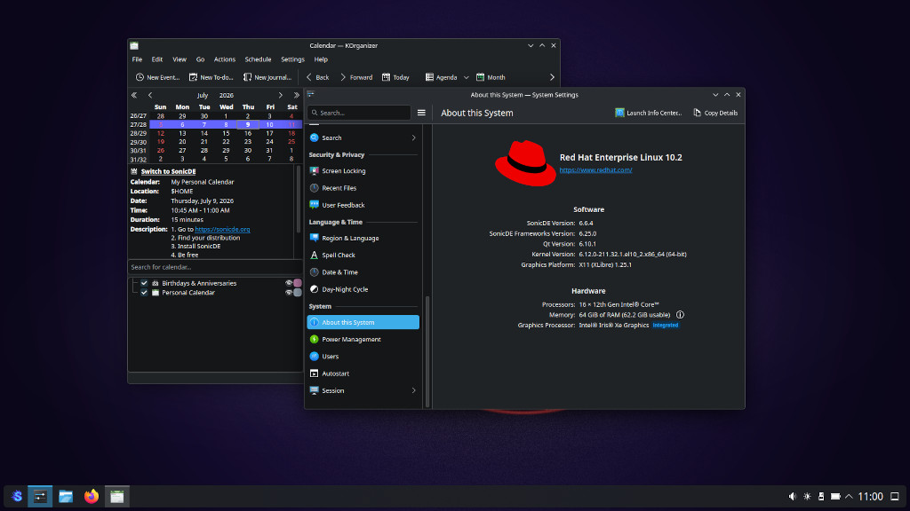

# SonicDE for Enterprise Linux 10

This third-party repository provides [SonicDE](https://sonicde.org) source and binary packages for [Enterprise Linux](https://www.redhat.com/en/technologies/linux-platforms/enterprise-linux)-based distributions. SonicDE, or the Sonic Desktop Environment, aims to preserve and improve the X11-specific aspects of KDE. You can learn more about SonicDE at [sonicde.org](https://sonicde.org/).

The packages of this repository are known to work with [AlmaLinux](https://almalinux.org/), [Red Hat Enterprise Linux (RHEL)](https://www.redhat.com/en/technologies/linux-platforms/enterprise-linux), [Oracle Linux](https://www.oracle.com/linux), and [Rocky Linux](https://rockylinux.org).

## Installing SonicDE Manually

### Choosing an X11 Display Server

Since EL10 doesn't have any X11 server by default or in the official repos, you need to install one. We recommend using the XLibre X11 server. Follow the installation instructions on the [XLibre for Fedora and EL Github page](https://github.com/xlibre-fedora-el/rpmspecs).

### Enabling the Repository

> [!warning]
> Beware that SonicDE has removed the Wayland parts, so the Wayland session may not work after installing it even though it is listed as an option in the display manager. You may not be able to start KDE Wayland anymore. Proceed at your own risk.

Add the SonicDE repository to your system:

```shell
sudo dnf config-manager --add-repo https://copr.fedorainfracloud.org/coprs/g/SonicDE/SonicDE-EL10/repo/rhel+epel-10/group_SonicDE-SonicDE-EL10-rhel+epel-10.repo
```

### Installing SonicDE

When XLibre has been installed, you can install the SonicDE packages and other needed X11 packages by running this command:

```shell
sudo dnf install --allowerasing xorg-x11-xinit xkbcomp xinput xrandr \
    sonic-workspace sonic-workspace-libs sonic-workspace-common \
    sonic-workspace-x11 sonic-win sonic-desktop-interface \
    sonic-interface-libraries sonic-keybind-daemon \
    sonic-frameworks-windowsystem sonic-system-info sonic-screen \
    sonic-screen-library sonic-sysguard-library
```

### Rebooting Your System

Now reboot your system. At the login screen choose "Plasma (X11)" as the session type. Log in with your credentials, start the program System Settings and verify that you’re running SonicDE on the “About this System” page. You do? Congratulations!

## Getting in Contact

Please report any enhancement requests or issues with this repository at [Issues · sonicde-fedora-el/rpmspecs](https://github.com/sonicde-fedora-el/rpmspecs/issues). In case you need help, want to report success or talk about other aspects, please also check the official SonicDE channels.

&nbsp;[Bluesky](https://bsky.app/profile/sonicdesktop.bsky.social)&nbsp; &nbsp;[Discord](https://discord.gg/cNZMQ62u5S) &nbsp; &nbsp;[Mastodon](https://mastodon.social/@sonicdesktop) &nbsp; &nbsp;[Matrix](https://matrix.to/#/#sonicdesktop:matrix.org) &nbsp; &nbsp;[OFTC IRC](https://webchat.oftc.net/?channels=sonicde%2Csonicde-devel%2Csonicde-dist&uio=MT11bmRlZmluZWQb1) &nbsp; &nbsp;[Telegram](https://t.me/sonic_de) &nbsp; &nbsp;[X (Twitter)](https://x.com/SonicDesktop)

